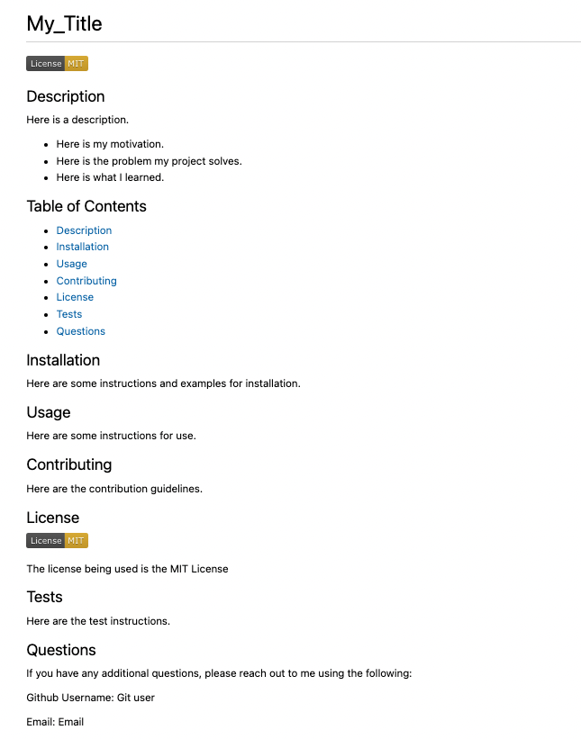

# README_Template

## Description

This is a professional README template designed for the coder who wants to spend more time coding and less time writing. 

- It can be cumbersome to write out an explanation of your project after hours of tedious work building it. This template is provided to aid in that area.
- My hope is that this project will aid other coders and allow them to spend more time coding and less time writing.
- I feel more confident in implementing functions, and I have a better understanding of the benefits of using multiple files.

## Installation

1. Open VS Code Terminal
2. Enter `npm i inquirer@8.2.4` into the command line

## Usage

1. Open "README_TEMPLATE" in Visual Studio Code
2. Open Integrated Terminal
3. Install Inquirer (refer to steps above)
4. Type "node index.js" into the command line
5. Answer the prompted questions how you would like them to be displayed in your README file. ie. Use complete sentences and capital letters where applicable.
6. Open the "README_temp_completed.md file to view your creation!

Please see the video below for an example of how this project works:

https://www.awesomescreenshot.com/video/11878531?key=822f4c088241f6a20cf1c5ee7c74855a

Here is an example of the ReadMe Template to be created after your input:

## Credits

This article was referenced regarding a professional README guide:
https://coding-boot-camp.github.io/full-stack/github/professional-readme-guide

## License

  
---